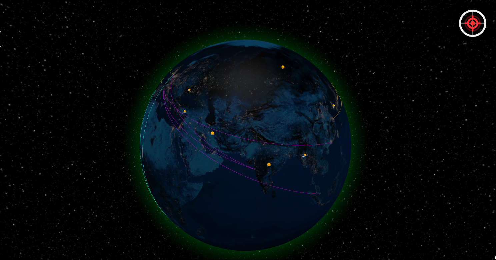

# 🌐 NetMonitor: Malha de Inteligência Global & Liberdade de Rede


O **NetMonitor** é uma plataforma de inteligência de alta densidade projetada para monitorar a liberdade na internet global em tempo real. O sistema cruza sinais técnicos de rede com eventos geopolíticos e imagens de satélite para distinguir entre **censura estatal**, **falhas de infraestrutura** e **conflitos cinéticos**.



---

## 📖 Visão Geral

Diferente de dashboards convencionais, o NetMonitor foca na **correlação de sinais**. Se uma rede cai, o sistema pergunta: *Houve um incêndio perto de um data center? Existe um protesto ocorrendo nessa cidade? O BGP foi sequestrado?*

Esta ferramenta foi construída para pesquisadores, jornalistas e defensores dos direitos digitais que precisam de uma visão holística e imediata do estado da rede global.

---

## 🚀 Camadas de Inteligência

O sistema opera integrando diversas fontes de dados em três níveis críticos:

### 1. Camada Física (Infraestrutura)
- **Cabos Submarinos:** Mapeamento da espinha dorsal física de fibra óptica global via TeleGeography.
- **NASA FIRMS:** Monitoramento de anomalias térmicas (incêndios/explosões) em tempo real, integrando dados dos satélites MODIS e VIIRS.
- **GDELT GKG:** Processamento de notícias globais para identificar protestos e conflitos físicos.

### 2. Camada Lógica (Protocolos)
- **IODA (CAIDA):** Detecção de quedas massivas de tráfego via BGP e active probing.
- **Cloudflare Radar:** Insights sobre volume de tráfego, ataques DDoS e adoção de novos protocolos.
- **RIPE Stat:** Visibilidade de prefixos e rotas para detectar isolamentos regionais.

### 3. Camada de Conteúdo (Acesso)
- **OONI (Tor Project):** Testes de conectividade para detectar bloqueios de sites e aplicativos de mensagens.
- **GreyNoise:** Identificação de IPs maliciosos e atividades de botnets.
- **URLhaus:** Diferenciação entre bloqueios de segurança (malware) e censura política.

---

## 🧠 Inteligência Artificial (AI Insight)

O NetMonitor utiliza o modelo **Llama 3.1 70B** para analisar a convergência de dados a cada ciclo:
- **Classificação de Incidentes:** A IA avalia a probabilidade de um evento ser censura ou falha técnica.
- **Relatórios Gerados:** Explicações em linguagem natural sobre incidentes complexos.
- **Confiança de Dados:** Atribui um nível de confiança baseado na consistência entre múltiplas fontes.

---

## 🛠 Tecnologias

- **Framework:** [Next.js 15](https://nextjs.org/) (App Router & Edge Functions)
- **Visualização 3D:** [React-Globe.gl](https://github.com/vasturiano/react-globe.gl) & [Three.js](https://threejs.org/)
- **Estilização:** [Tailwind CSS](https://tailwindcss.com/)
- **Banco de Dados & Cache:** [Upstash Redis](https://upstash.com/)
- **Ícones:** [Lucide React](https://lucide.dev/)

---

## ⚙️ Instalação e Setup

### Pré-requisitos
- Node.js 18+
- Conta na Upstash (Redis)
- Chave de API da Groq

### Passo a Passo

1. **Clone o repositório:**
   ```bash
   git clone https://github.com/schnnjuan/Net-Monitor.git
   cd Net-Monitor
   ```

2. **Instale as dependências:**
   ```bash
   npm install
   ```

3. **Configure as variáveis de ambiente:**
   Crie um arquivo `.env` na raiz:
   ```env
   # Inteligência Artificial (Groq)
   GROQ_API_KEY=sua_chave_aqui

   # Cache e Persistência (Upstash)
   UPSTASH_REDIS_REST_URL=https://...
   UPSTASH_REDIS_REST_TOKEN=seu_token_aqui

   # Chaves de API de Fontes (Opcionais para algumas funcionalidades)
   CLOUDFLARE_TOKEN=seu_token_radar
   NASA_FIRMS_MAP_KEY=sua_chave_nasa
   ACLED_API_KEY=sua_chave_acled
   ACLED_API_EMAIL=seu_email
   ```

4. **Inicie o ambiente de desenvolvimento:**
   ```bash
   npm run dev
   ```

---

## 🤝 Contribuindo

Contribuições são o que tornam a comunidade open source um lugar incrível para aprender, inspirar e criar. Qualquer contribuição que você fizer será **muito apreciada**.

1. Faça um Fork do projeto
2. Crie uma Branch para sua Feature (`git checkout -b feature/AmazingFeature`)
3. Commit suas mudanças (`git commit -m 'Add some AmazingFeature'`)
4. Push para a Branch (`git push origin feature/AmazingFeature`)
5. Abra um Pull Request

---

## 📜 Licença

Distribuído sob a licença **MIT**. Veja `LICENSE` para mais informações.

---

## 📬 Contato

**schnnjuan** - [@schnnjuan](https://github.com/schnnjuan)

Link do Projeto: [https://github.com/schnnjuan/Net-Monitor](https://github.com/schnnjuan/Net-Monitor)

---
*Dados fornecidos por: OONI, CAIDA, NASA, TeleGeography, Cloudflare e GDELT Project.*
